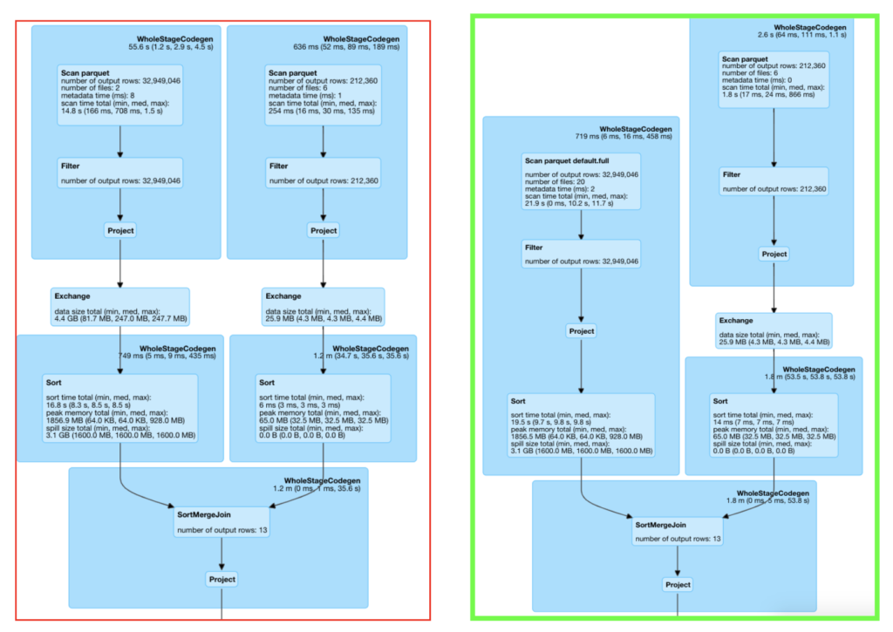

Originaly posted at [Taboola engineering blog](https://engineering.taboola.com/bucket-the-shuffle-out-of-here/)

# Intro
At Taboola we use Spark extensively throughout the pipeline. Regularly faced with Spark-related scalability challenges, we look for optimisations in order to squeeze the most out of the library. Often, the problems we encounter are related to shuffles.


In this post we will present a technique we discovered which gave us up to 8x boost in performance for jobs with huge data shuffles.


# Shuffles
Shuffling is a process of redistributing data across partitions (aka repartitioning) that may or may not cause moving data across JVM processes or even over the wire (between executors on separate machines).


Shuffles, despite their drawbacks, are sometimes inevitable. In our case, here are some of the problems we faced:

* Performance hit - Jobs run longer because shuffles use network and IO resources intensively.
* Cluster stability - Heavy shuffles fill scratch disks of cluster machines. This affects other jobs on the same cluster , since they all share the same worker nodes. A single heavy job can fill-up all scratch(aka temp) disk space on all machines causing cluster unavailability.


# Where it meets us
One of our many Spark jobs is to calculate some long term counters. We hold the following data: (group key, counter key, counter type) as key and (counter value, update time) as value. This job prepares input for other downstream jobs (ML, analytics etc) which makes it important for the overall progress of daily computations.

We have “base” data to which we add daily aggregated changes. The daily deltas per key take up  around 3% of the “base” data in terms of volume (several hundreds of gigabytes vs several terabytes).

The naive approach in this scenario would be (pseudo-sql):

```sql
select sum(counter_value), max(update_timestamp)
  from 
    (select * from base union select * from all-deltas)
  group by 
     group_key, counter_type, counter_key
 ```


We started with the naive approach, it worked great and wasn't hard to implement, enabling us to deploy downstream jobs as well. However, as time passed the "base" data grew considerably. At some point the job started to fail.


The job was failing with disk out of space errors. After looking at Spark UI stats we noticed huge shuffles of base data filling up all scratch disks on the application executors.

At first we tried to increase the number of “spark.sql.shuffle.partitions”. Increasing the number of partitions means also reducing the size of each shuffle part. We also tried to rewrite a bit sql by pre-aggregating data by parts.

Neither of the two ideas helped. The first approach might help when some executors work harder than others, but we didn’t have any skew in data. The second approach didn't help since the "base" data still needed to be reshuffled which caused the same problem.


# Partitioning of data
After all previous failures, we defined our prime objective: avoid shuffles of our "base" data. Usually, this happens if spark knows how the data is partitioned. For example, joining two RDDs when only one of them has a partitioner. In this case Spark will reshuffle the second rdd using the partitioner of the first rdd.


Our first approach was to partition by key while saving the dataframe (in our case the key is a compound one). However, the partitionBy method creates a subdirectory for every partition. This is effective when partition key cardinality is low and usable when the cardinality is finite. In our case the group_key has very large cardinality (millions of distinct values), which makes this approach infeasible.

An example of how partitioning is used at saving:

```java 
resultDf.write()
    .mode(SaveMode.Overwrite)
    .partitionBy("group_key", "counter_type", "counter_key")
    .parquet(outputPath)
````


Our next idea was to use a relatively new feature called Bucketing. This feature provides kind of “partitioning by key” the same way as the standard partitioning provides. The change here is that it lets you divide the partitions into finite number of buckets(i.e. good also for high cardinality keys).

However before explaining how to use it, we should talk about another optimisation we came across while working on bucketing: sql refactoring.


# SQL refactoring
We have noticed that our base data is already aggregated and every key appears only once.

Since our “base” data has a unique key, it doesn't need to be aggregated. On the other hand, all daily deltas may have multiple updates for the same key. As such the daily deltas need to be aggregated as described in the naive approach.

Instead of using UNION on the two datasets and then aggregating both of them, we can split this process into two stages: at the beginning pre-aggregating daily deltas into a dataset that contains every key once, and then joining with “base” data by full outer join to compute updated value for every key.

Replacing aggregation with a Full Outer Join (pseudo-sql):

```sql 
with daily_input_agg as (
select sum(counter_value), max(update_timestamp)
from 
  union (all - deltas) -- not on base anymore!
group by 
  group_key, counter_type, counter_key)
-- sort + repartition)

SELECT
  COALESCE(b.group_key, d.group_key) AS group_key,
  COALESCE(b.counter_key, d.counter_key) AS counter_key,
  COALESCE(b.counter_type, d.counter_type) AS counter_type,
  COALESCE(b.counter_value, 0) + COALESCE(d.counter_value, 0) AS counter_value,
  COALESCE(d.update_time, b.update_time, CAST (0 AS Timestamp)) AS update_time

FROM  
  base b FULL OUTER JOIN daily_input_agg d
ON 
  b.group_key = d.group_key AND b.counter_type = d.counter_type AND b.counter_key = d.counter_key
```


Using the  full outer join we can finally apply the bucketing technique to avoid  the base data shuffle.


# Bucketing
Bucketing is a concept that came from Hive. When using spark for computations over Hive tables, the below manual implementation might be irrelevant and cumbersome. However, we are still not using Hive and needed to overcome all gotchas along the way. This is a relatively new feature and as you will see it comes with lots of potential pitfalls.


Schematically when using bucketing you'll follow several steps:

* Save the data bucketed
* Read data bucketed
** Maybe in a different SparkContext
** Providing the number of buckets


Writing example:

```java
resultDf.write()
      .option("path",outputPath)
      .mode(SaveMode.Overwrite)
      .bucketBy(numberOfOutputBuckets, "group_key", "counter_type", "counter_key")
      .sortBy("group_key", "counter_type", "counter_key")
   .saveAsTable(outputTableName);
```

* Sorted data produces fewer files - Without sorting, spark will create many files per each partition for some bucket. With sorting by same key as bucketing key only one file per partition per bucket will be created.
* Read the same way it was bucketed - During bucketing Spark uses hash function + modulo on the bucketing key to choose to which bucket to write data to. It's very important to preserve the same number of buckets between the reads and writes of the data.
* Both sides of the JOIN need to be “aligned” - in case the deltas are not partitioned with the same number of partitions both parts of the JOIN will be reshuffled.

So an obvious solution in our case is to partition the “daily” data the same way we read the “base” data.

```java
daily_agg_repartitioned = daily_agg
   .repartition(N, col("group_key"), col("counter_type"), col("counter_key") )
```
No one API to bucket them all - bucketing of data is not available for the usual dataframe api, but only when using the table api. In addition, to read data while preserving bucketing information one should use table api as well.

We read data by defining external table backed up by hdfs path, while specifying that the table is bucketed. example:

```java
sparkSession.sql(
      "CREATE TABLE base(" +
              "  group_key string ," +
              "  counter_type string, " +
              "  counter_key string ," +
              "  counter_value double," +
              "  update_time timestamp ) " +
              "    USING PARQUET\n" +
              "    CLUSTERED BY (group_key, counter_type, counter_key) INTO " +
                              numberOfInputBuckets + " BUCKETS " +
              "    LOCATION '" + path + "'");
```

* Partitions same as buckets - another voodoo notion we came across is that spark.sql.shuffle.partitions must be same as number of buckets, otherwise we once again get "base" shuffle.


# Results
So did this help our cause? Yes. The job now finishes x8 times faster than before and cluster stability is restored.



As you can see in the green boxed Spark Sql execution plan, the right branch is missing an Exchange (i.e. shuffle). When trying to optimize a spark job, use sql tab to understand if your changes helped or not(the picture attached are on test data and doesn't represent production workloads, however the implementation of removing "base" shuffles has not changed).


Overall, bucketing is a relatively new technique that in some cases might be a great improvement both in stability and performance. However we found that using it is not trivial and has many gotchas.
